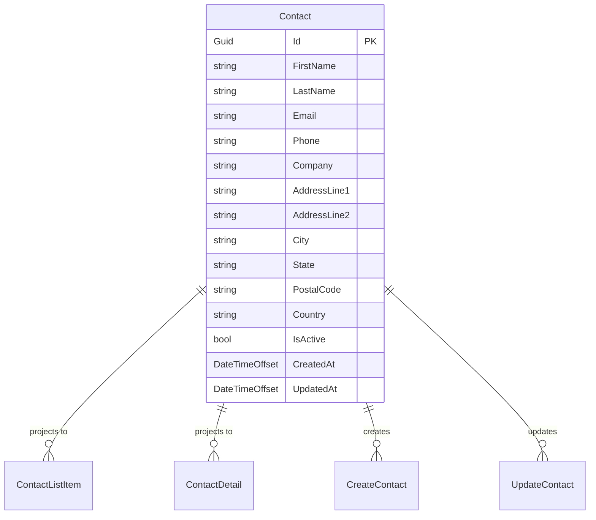

# Data Model Architecture

## Entity Relationship Diagram



## Core Entity: Contact

### Entity Definition

```csharp
public class Contact
{
    public Guid Id { get; set; }
    public string FirstName { get; set; } = string.Empty;
    public string LastName { get; set; } = string.Empty;
    public string Email { get; set; } = string.Empty;
    public string? Phone { get; set; }
    public string? Company { get; set; }
    public string? AddressLine1 { get; set; }
    public string? AddressLine2 { get; set; }
    public string? City { get; set; }
    public string? State { get; set; }
    public string? PostalCode { get; set; }
    public string? Country { get; set; }
    public bool IsActive { get; set; } = true;
    public DateTimeOffset CreatedAt { get; set; }
    public DateTimeOffset UpdatedAt { get; set; }
}
```

### Entity Configuration

```csharp
public class ContactConfiguration : IEntityTypeConfiguration<Contact>
{
    public void Configure(EntityTypeBuilder<Contact> builder)
    {
        builder.HasKey(c => c.Id);
        
        builder.Property(c => c.FirstName)
            .IsRequired()
            .HasMaxLength(100);
            
        builder.Property(c => c.LastName)
            .IsRequired()
            .HasMaxLength(100);
            
        builder.Property(c => c.Email)
            .IsRequired()
            .HasMaxLength(255);
            
        builder.Property(c => c.Phone)
            .HasMaxLength(20);
            
        builder.Property(c => c.Company)
            .HasMaxLength(200);
            
        builder.Property(c => c.AddressLine1)
            .HasMaxLength(255);
            
        builder.Property(c => c.AddressLine2)
            .HasMaxLength(255);
            
        builder.Property(c => c.City)
            .HasMaxLength(100);
            
        builder.Property(c => c.State)
            .HasMaxLength(100);
            
        builder.Property(c => c.PostalCode)
            .HasMaxLength(20);
            
        builder.Property(c => c.Country)
            .HasMaxLength(100);
            
        builder.Property(c => c.CreatedAt)
            .HasDefaultValueSql("GETUTCDATE()");
            
        builder.Property(c => c.UpdatedAt)
            .HasDefaultValueSql("GETUTCDATE()");
            
        // Indexes for performance
        builder.HasIndex(c => c.Email).IsUnique();
        builder.HasIndex(c => new { c.FirstName, c.LastName });
        builder.HasIndex(c => c.Company);
        builder.HasIndex(c => c.IsActive);
    }
}
```

## Data Transfer Objects (DTOs)

### ContactListItemDto
Used for displaying contacts in tables and lists.

```csharp
public class ContactListItemDto
{
    public Guid Id { get; set; }
    public string FirstName { get; set; } = string.Empty;
    public string LastName { get; set; } = string.Empty;
    public string Email { get; set; } = string.Empty;
    public string? Company { get; set; }
    public bool IsActive { get; set; }
    public DateTimeOffset CreatedAt { get; set; }
}
```

### ContactDetailDto
Used for displaying full contact details.

```csharp
public class ContactDetailDto
{
    public Guid Id { get; set; }
    public string FirstName { get; set; } = string.Empty;
    public string LastName { get; set; } = string.Empty;
    public string Email { get; set; } = string.Empty;
    public string? Phone { get; set; }
    public string? Company { get; set; }
    public string? AddressLine1 { get; set; }
    public string? AddressLine2 { get; set; }
    public string? City { get; set; }
    public string? State { get; set; }
    public string? PostalCode { get; set; }
    public string? Country { get; set; }
    public bool IsActive { get; set; }
    public DateTimeOffset CreatedAt { get; set; }
    public DateTimeOffset UpdatedAt { get; set; }
}
```

### CreateContactDto
Used for creating new contacts.

```csharp
public class CreateContactDto
{
    public string FirstName { get; set; } = string.Empty;
    public string LastName { get; set; } = string.Empty;
    public string Email { get; set; } = string.Empty;
    public string? Phone { get; set; }
    public string? Company { get; set; }
    public string? AddressLine1 { get; set; }
    public string? AddressLine2 { get; set; }
    public string? City { get; set; }
    public string? State { get; set; }
    public string? PostalCode { get; set; }
    public string? Country { get; set; }
    public bool IsActive { get; set; } = true;
}
```

### UpdateContactDto
Used for updating existing contacts.

```csharp
public class UpdateContactDto
{
    public string FirstName { get; set; } = string.Empty;
    public string LastName { get; set; } = string.Empty;
    public string Email { get; set; } = string.Empty;
    public string? Phone { get; set; }
    public string? Company { get; set; }
    public string? AddressLine1 { get; set; }
    public string? AddressLine2 { get; set; }
    public string? City { get; set; }
    public string? State { get; set; }
    public string? PostalCode { get; set; }
    public string? Country { get; set; }
    public bool IsActive { get; set; }
}
```

## Data Mapping Profiles

### AutoMapper Configuration

```csharp
public class ContactMappingProfile : Profile
{
    public ContactMappingProfile()
    {
        // Entity to DTO mappings
        CreateMap<Contact, ContactListItemDto>()
            .ForMember(dest => dest.Id, opt => opt.MapFrom(src => src.Id))
            .ForMember(dest => dest.FirstName, opt => opt.MapFrom(src => src.FirstName))
            .ForMember(dest => dest.LastName, opt => opt.MapFrom(src => src.LastName))
            .ForMember(dest => dest.Email, opt => opt.MapFrom(src => src.Email))
            .ForMember(dest => dest.Company, opt => opt.MapFrom(src => src.Company))
            .ForMember(dest => dest.IsActive, opt => opt.MapFrom(src => src.IsActive))
            .ForMember(dest => dest.CreatedAt, opt => opt.MapFrom(src => src.CreatedAt));

        CreateMap<Contact, ContactDetailDto>();

        // DTO to Entity mappings
        CreateMap<CreateContactDto, Contact>()
            .ForMember(dest => dest.Id, opt => opt.Ignore())
            .ForMember(dest => dest.CreatedAt, opt => opt.Ignore())
            .ForMember(dest => dest.UpdatedAt, opt => opt.Ignore());

        CreateMap<UpdateContactDto, Contact>()
            .ForMember(dest => dest.Id, opt => opt.Ignore())
            .ForMember(dest => dest.CreatedAt, opt => opt.Ignore())
            .ForMember(dest => dest.UpdatedAt, opt => opt.Ignore());
    }
}
```

## Database Context

### AppDbContext Configuration

```csharp
public class AppDbContext : DbContext
{
    public DbSet<Contact> Contacts { get; set; } = null!;

    public AppDbContext(DbContextOptions<AppDbContext> options) : base(options)
    {
    }

    protected override void OnModelCreating(ModelBuilder modelBuilder)
    {
        base.OnModelCreating(modelBuilder);
        
        // Apply configurations
        modelBuilder.ApplyConfiguration(new ContactConfiguration());
        
        // Seed data
        SeedData(modelBuilder);
    }

    private void SeedData(ModelBuilder modelBuilder)
    {
        var contacts = new List<Contact>();
        var random = new Random();
        
        // Generate 150+ sample contacts
        var contactCount = 153;
        var firstNames = new[] { "John", "Jane", "Michael", "Sarah", "David", "Emily", "Robert", "Lisa", "James", "Mary" };
        var lastNames = new[] { "Smith", "Johnson", "Williams", "Brown", "Jones", "Garcia", "Miller", "Davis", "Rodriguez", "Martinez" };
        var companies = new[] { "Tech Corp", "Digital Solutions", "Innovation Inc", "Global Systems", "Future Technologies", "Smart Solutions", "Advanced Systems", "Modern Tech", "Digital Innovations", "Tech Solutions" };
        var cities = new[] { "New York", "Los Angeles", "Chicago", "Houston", "Phoenix", "Philadelphia", "San Antonio", "San Diego", "Dallas", "San Jose" };
        var states = new[] { "NY", "CA", "IL", "TX", "AZ", "PA", "TX", "CA", "TX", "CA" };
        
        for (int i = 1; i <= contactCount; i++)
        {
            var firstName = firstNames[random.Next(firstNames.Length)];
            var lastName = lastNames[random.Next(lastNames.Length)];
            var company = companies[random.Next(companies.Length)];
            var city = cities[random.Next(cities.Length)];
            var state = states[random.Next(states.Length)];
            
            contacts.Add(new Contact
            {
                Id = Guid.NewGuid(),
                FirstName = firstName,
                LastName = lastName,
                Email = $"{firstName.ToLower()}.{lastName.ToLower()}@example.com",
                Phone = $"555-{random.Next(100, 999)}-{random.Next(1000, 9999)}",
                Company = company,
                AddressLine1 = $"{random.Next(100, 999)} Main St",
                AddressLine2 = random.Next(0, 2) == 1 ? $"Apt {random.Next(1, 999)}" : null,
                City = city,
                State = state,
                PostalCode = $"{random.Next(10000, 99999)}",
                Country = "USA",
                IsActive = random.Next(0, 10) > 1, // 90% active
                CreatedAt = DateTimeOffset.UtcNow.AddDays(-random.Next(1, 365)),
                UpdatedAt = DateTimeOffset.UtcNow.AddDays(-random.Next(0, 30))
            });
        }
        
        modelBuilder.Entity<Contact>().HasData(contacts);
    }
}
```

## TypeScript Frontend Types

### Base Contact Interface

```typescript
export interface Contact {
  id: string;
  firstName: string;
  lastName: string;
  email: string;
  phone?: string;
  company?: string;
  addressLine1?: string;
  addressLine2?: string;
  city?: string;
  state?: string;
  postalCode?: string;
  country?: string;
  isActive: boolean;
  createdAt: string;
  updatedAt: string;
}
```

### List and Detail Types

```typescript
export interface ContactListItem {
  id: string;
  firstName: string;
  lastName: string;
  email: string;
  company?: string;
  isActive: boolean;
  createdAt: string;
}

export interface ContactDetail extends Contact {}

export interface CreateContact {
  firstName: string;
  lastName: string;
  email: string;
  phone?: string;
  company?: string;
  addressLine1?: string;
  addressLine2?: string;
  city?: string;
  state?: string;
  postalCode?: string;
  country?: string;
  isActive?: boolean;
}

export interface UpdateContact extends Omit<CreateContact, 'id'> {}
```

### API Response Types

```typescript
export interface ContactListResponse {
  items: ContactListItem[];
  total: number;
  page: number;
  pageSize: number;
  sort?: string;
  dir?: 'asc' | 'desc';
}

export interface ContactQueryParams {
  query?: string;
  page?: number;
  pageSize?: number;
  sort?: string;
  dir?: 'asc' | 'desc';
  isActive?: boolean;
}
```

## Validation Rules

### Backend Validation (FluentValidation)

```csharp
public class CreateContactValidator : AbstractValidator<CreateContactDto>
{
    public CreateContactValidator()
    {
        RuleFor(x => x.FirstName)
            .NotEmpty()
            .MaximumLength(100)
            .WithMessage("First name is required and must be less than 100 characters.");

        RuleFor(x => x.LastName)
            .NotEmpty()
            .MaximumLength(100)
            .WithMessage("Last name is required and must be less than 100 characters.");

        RuleFor(x => x.Email)
            .NotEmpty()
            .MaximumLength(255)
            .EmailAddress()
            .WithMessage("Valid email address is required.");

        RuleFor(x => x.Phone)
            .MaximumLength(20)
            .Matches(@"^\d{3}-\d{3}-\d{4}$")
            .When(x => !string.IsNullOrEmpty(x.Phone))
            .WithMessage("Phone number must be in format 555-555-5555.");

        RuleFor(x => x.Company)
            .MaximumLength(200)
            .WithMessage("Company name must be less than 200 characters.");

        RuleFor(x => x.AddressLine1)
            .MaximumLength(255)
            .WithMessage("Address line 1 must be less than 255 characters.");

        RuleFor(x => x.AddressLine2)
            .MaximumLength(255)
            .WithMessage("Address line 2 must be less than 255 characters.");

        RuleFor(x => x.City)
            .MaximumLength(100)
            .WithMessage("City must be less than 100 characters.");

        RuleFor(x => x.State)
            .MaximumLength(100)
            .WithMessage("State must be less than 100 characters.");

        RuleFor(x => x.PostalCode)
            .MaximumLength(20)
            .WithMessage("Postal code must be less than 20 characters.");

        RuleFor(x => x.Country)
            .MaximumLength(100)
            .WithMessage("Country must be less than 100 characters.");
    }
}
```

### Frontend Validation (Zod)

```typescript
import { z } from 'zod';

export const createContactSchema = z.object({
  firstName: z.string()
    .min(1, 'First name is required')
    .max(100, 'First name must be less than 100 characters'),
  lastName: z.string()
    .min(1, 'Last name is required')
    .max(100, 'Last name must be less than 100 characters'),
  email: z.string()
    .min(1, 'Email is required')
    .max(255, 'Email must be less than 255 characters')
    .email('Invalid email address'),
  phone: z.string()
    .max(20, 'Phone must be less than 20 characters')
    .regex(/^\d{3}-\d{3}-\d{4}$/, 'Phone must be in format 555-555-5555')
    .optional()
    .or(z.literal('')),
  company: z.string()
    .max(200, 'Company must be less than 200 characters')
    .optional()
    .or(z.literal('')),
  addressLine1: z.string()
    .max(255, 'Address line 1 must be less than 255 characters')
    .optional()
    .or(z.literal('')),
  addressLine2: z.string()
    .max(255, 'Address line 2 must be less than 255 characters')
    .optional()
    .or(z.literal('')),
  city: z.string()
    .max(100, 'City must be less than 100 characters')
    .optional()
    .or(z.literal('')),
  state: z.string()
    .max(100, 'State must be less than 100 characters')
    .optional()
    .or(z.literal('')),
  postalCode: z.string()
    .max(20, 'Postal code must be less than 20 characters')
    .optional()
    .or(z.literal('')),
  country: z.string()
    .max(100, 'Country must be less than 100 characters')
    .optional()
    .or(z.literal('')),
  isActive: z.boolean().default(true),
});

export type CreateContactFormData = z.infer<typeof createContactSchema>;
export const updateContactSchema = createContactSchema.omit({ isActive: true }).partial();
export type UpdateContactFormData = z.infer<typeof updateContactSchema>;
```

## Data Access Patterns

### Repository Pattern (Optional)

```csharp
public interface IContactRepository
{
    Task<IEnumerable<Contact>> GetAllAsync();
    Task<Contact?> GetByIdAsync(Guid id);
    Task<IEnumerable<Contact>> SearchAsync(string query, int page, int pageSize, string sort, string dir);
    Task<Contact> CreateAsync(Contact contact);
    Task<Contact> UpdateAsync(Contact contact);
    Task<bool> DeleteAsync(Guid id);
}

public class ContactRepository : IContactRepository
{
    private readonly AppDbContext _context;
    
    public ContactRepository(AppDbContext context)
    {
        _context = context;
    }
    
    public async Task<IEnumerable<Contact>> GetAllAsync()
    {
        return await _context.Contacts.ToListAsync();
    }
    
    public async Task<Contact?> GetByIdAsync(Guid id)
    {
        return await _context.Contacts.FindAsync(id);
    }
    
    public async Task<IEnumerable<Contact>> SearchAsync(string query, int page, int pageSize, string sort, string dir)
    {
        var IQueryable<Contact> contacts = _context.Contacts;
        
        if (!string.IsNullOrEmpty(query))
        {
            contacts = contacts.Where(c => 
                c.FirstName.Contains(query) ||
                c.LastName.Contains(query) ||
                c.Email.Contains(query) ||
                (c.Phone != null && c.Phone.Contains(query)) ||
                (c.Company != null && c.Company.Contains(query)));
        }
        
        // Apply sorting
        contacts = ApplySorting(contacts, sort, dir);
        
        // Apply pagination
        return await contacts
            .Skip((page - 1) * pageSize)
            .Take(pageSize)
            .ToListAsync();
    }
    
    private IQueryable<Contact> ApplySorting(IQueryable<Contact> query, string sort, string dir)
    {
        // Implementation of sorting logic
        return sort.ToLower() switch
        {
            "firstname" => dir == "desc" ? query.OrderByDescending(c => c.FirstName) : query.OrderBy(c => c.FirstName),
            "lastname" => dir == "desc" ? query.OrderByDescending(c => c.LastName) : query.OrderBy(c => c.LastName),
            "email" => dir == "desc" ? query.OrderByDescending(c => c.Email) : query.OrderBy(c => c.Email),
            "company" => dir == "desc" ? query.OrderByDescending(c => c.Company) : query.OrderBy(c => c.Company),
            "createdat" => dir == "desc" ? query.OrderByDescending(c => c.CreatedAt) : query.OrderBy(c => c.CreatedAt),
            _ => query.OrderBy(c => c.LastName).ThenBy(c => c.FirstName)
        };
    }
    
    public async Task<Contact> CreateAsync(Contact contact)
    {
        _context.Contacts.Add(contact);
        await _context.SaveChangesAsync();
        return contact;
    }
    
    public async Task<Contact> UpdateAsync(Contact contact)
    {
        _context.Contacts.Update(contact);
        await _context.SaveChangesAsync();
        return contact;
    }
    
    public async Task<bool> DeleteAsync(Guid id)
    {
        var contact = await _context.Contacts.FindAsync(id);
        if (contact == null) return false;
        
        _context.Contacts.Remove(contact);
        await _context.SaveChangesAsync();
        return true;
    }
}
```

## Performance Considerations

### Indexing Strategy
- **Primary Key**: `Id` (clustered index)
- **Unique Index**: `Email` (for uniqueness and fast lookups)
- **Composite Index**: `(FirstName, LastName)` (for name searches)
- **Single Index**: `Company` (for company searches)
- **Filter Index**: `IsActive` (for active/inactive filtering)

### Query Optimization
- Use pagination to limit result sets
- Implement proper indexing for search fields
- Consider using stored procedures for complex queries
- Use projection to select only needed columns

### Caching Strategy
- Cache frequently accessed contact lists
- Implement cache invalidation on updates
- Use appropriate cache expiration policies
- Consider distributed caching for production

## Data Migration Strategy

### Development to Production Migration
1. **Schema Migration**: Generate SQL scripts from EF Core migrations
2. **Data Migration**: Export/import seed data and existing contact data
3. **Validation**: Verify data integrity after migration
4. **Rollback Plan**: Prepare rollback procedures for failed migrations

### Future Database Considerations
- **SQL Server**: Primary production target
- **PostgreSQL**: Alternative for cross-platform compatibility
- **SQLite**: Option for smaller deployments
- **Cosmos DB**: NoSQL option for scalability
