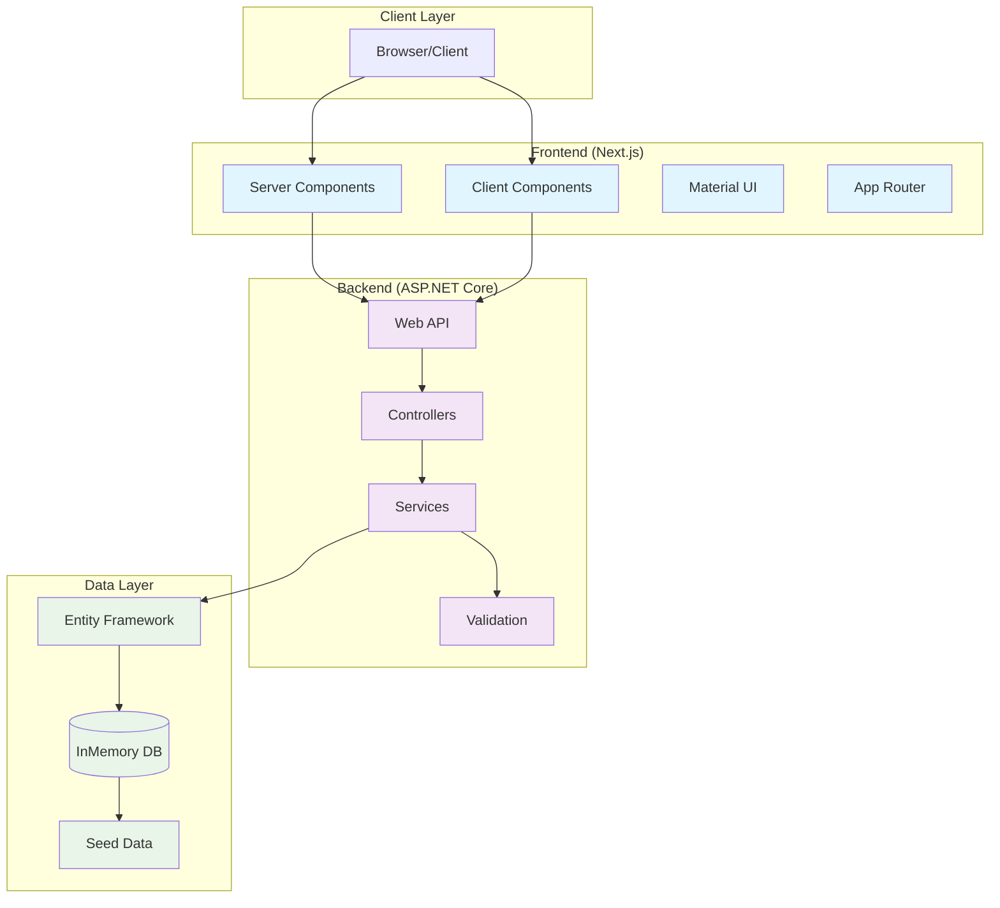
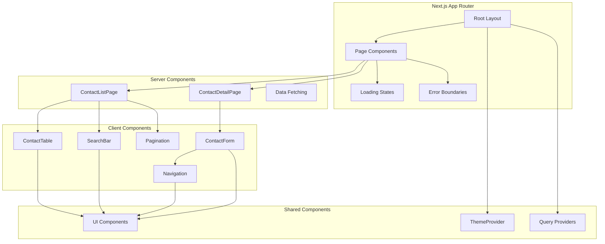
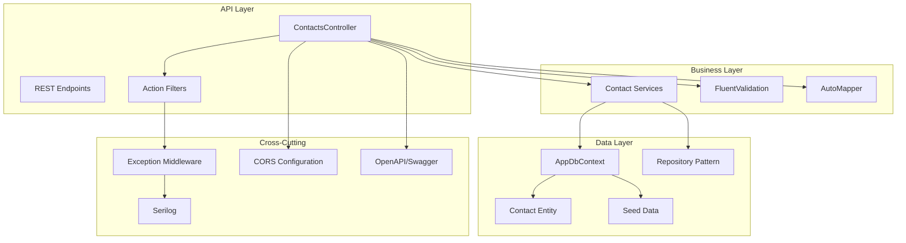
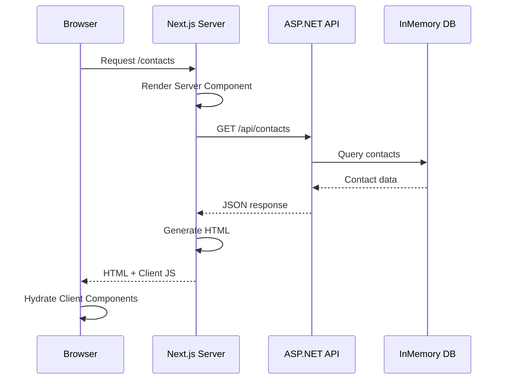
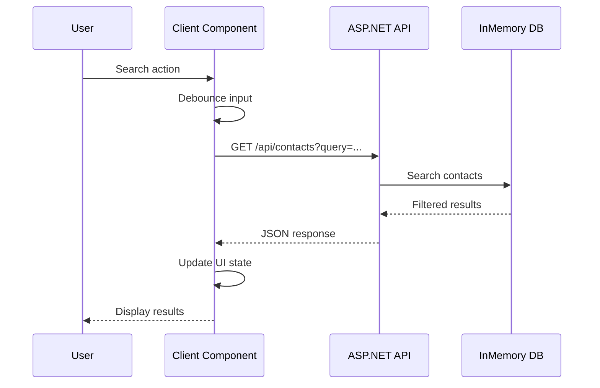
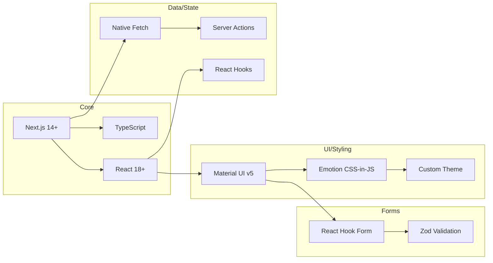
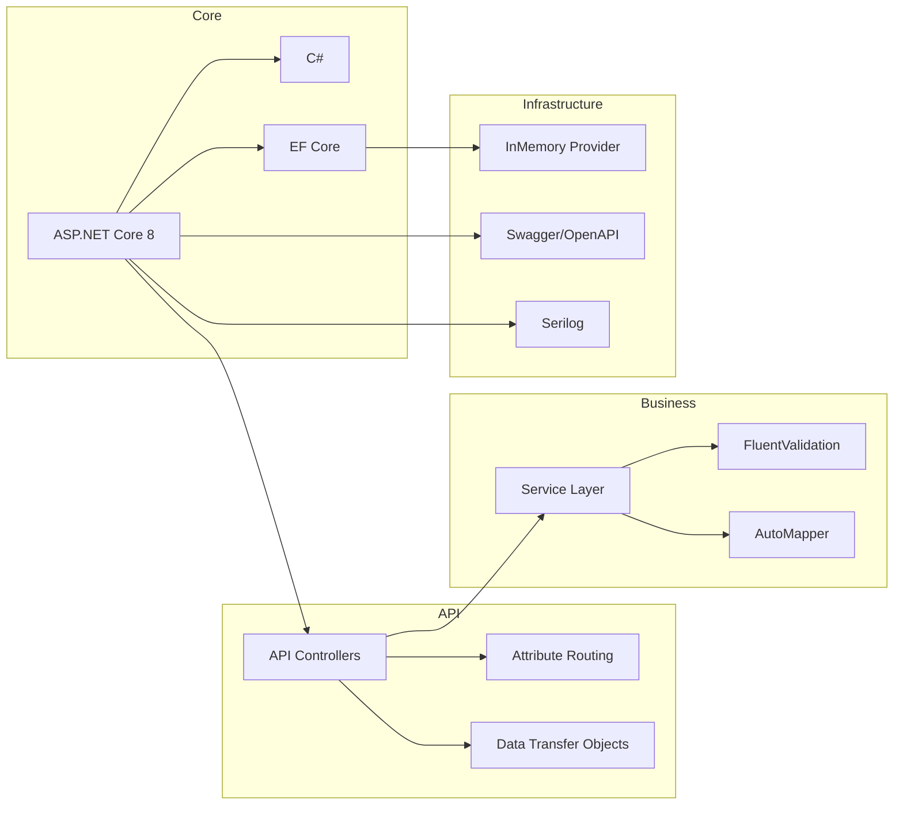
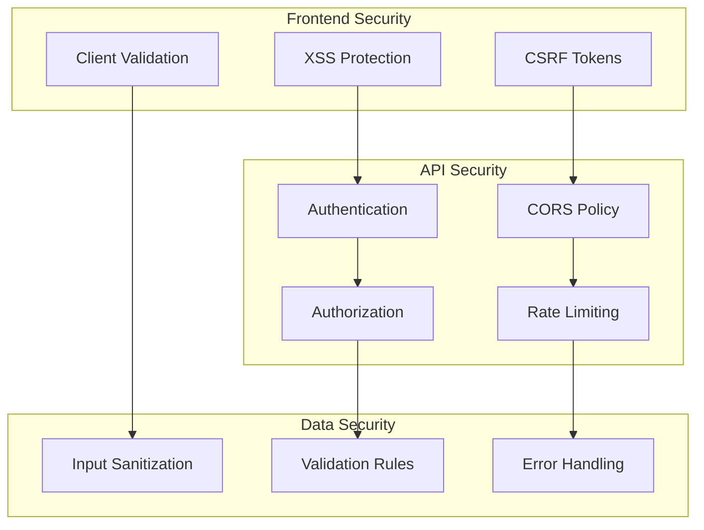
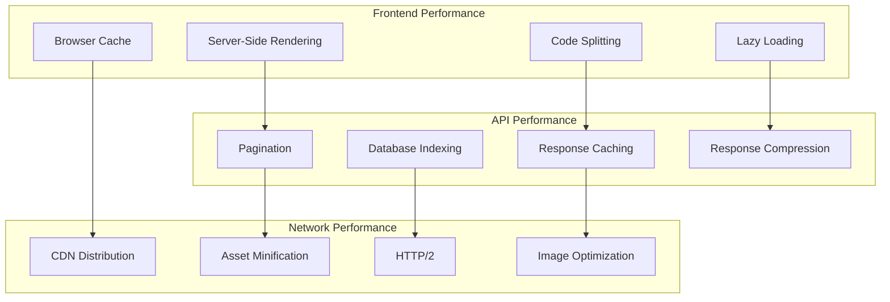
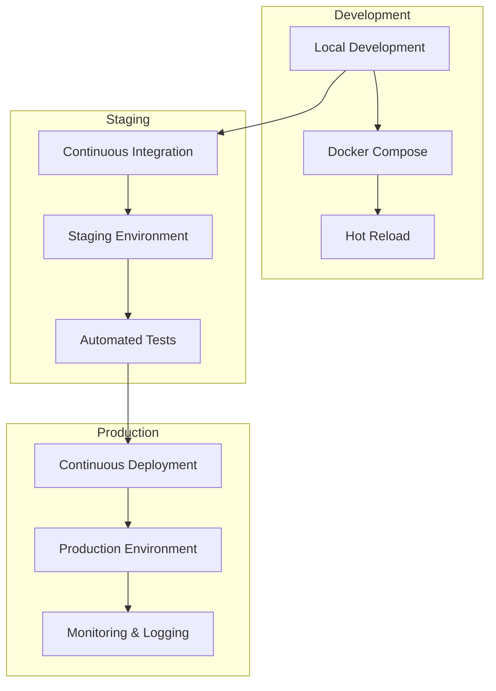

# System Architecture

## Overview

The CRM API system follows a modern web architecture with clear separation of concerns between frontend and backend, leveraging server-side rendering for optimal performance and SEO.

## High-Level Architecture

## Component Architecture

### Frontend Components

### Backend Architecture

## Data Flow Architecture

### Request Flow (Server-Side Rendering)

### Interactive Flow (Client Components)

## Technology Integration

### Frontend Stack Integration

### Backend Stack Integration

## Security Architecture

## Performance Architecture

## Deployment Architecture

## Key Architectural Decisions

### 1. Server-Side Rendering (SSR)
- **Rationale**: Fast initial loads, SEO optimization, better user experience
- **Implementation**: Next.js App Router with Server Components
- **Trade-offs**: Increased server load, more complex state management

### 2. Material UI Component Library
- **Rationale**: Consistent design system, accessibility features, rapid development
- **Implementation**: MUI v5 with custom theming
- **Trade-offs**: Bundle size, less design flexibility

### 3. Entity Framework Core InMemory
- **Rationale**: Rapid development, easy setup, no external dependencies
- **Implementation**: EF Core with InMemory provider for development
- **Trade-offs**: Not production-ready, limited SQL features

### 4. RESTful API Design
- **Rationale**: Standardized interface, easy client integration, tooling support
- **Implementation**: ASP.NET Core Web API with OpenAPI documentation
- **Trade-offs**: Multiple round trips, over-fetching/under-fetching

### 5. TypeScript Full Stack
- **Rationale**: Type safety, better developer experience, reduced runtime errors
- **Implementation**: TypeScript in frontend and C# strong typing in backend
- **Trade-offs**: Initial setup complexity, compilation overhead
